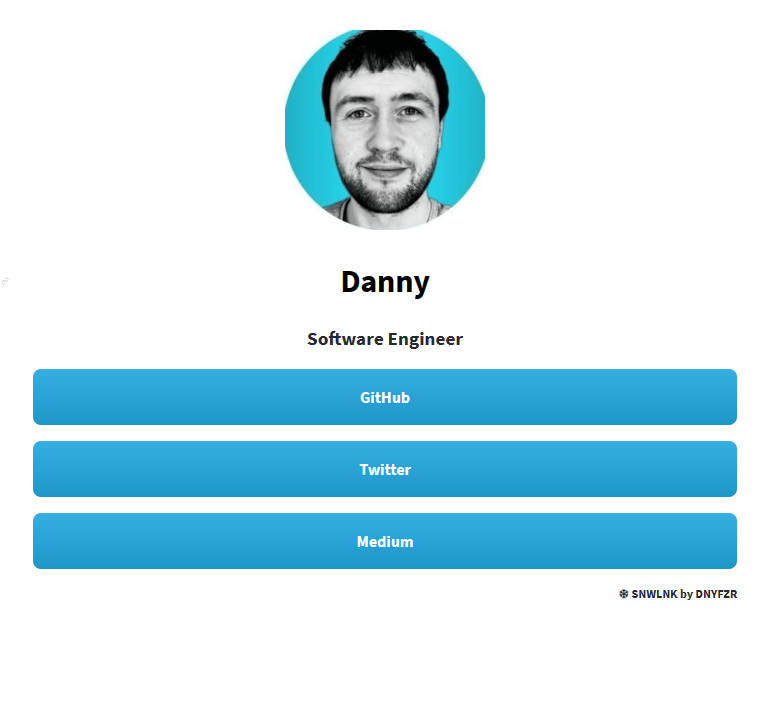

<h2 align="center"><b> ❄ SNWLNK ❄ </b></h2>

<p align="center">
    A social & professional link app to share links to all of your profiles / portfolios / projects.
</p>

<p align="center"></p>

---

<h4><b> App Configuration</b></h4>

The app is configured by updating a [YAML file](config/profile.yml) and loading your profile picture to the [config](config/) directory.

1. Fork the repo to your GitHub account

2. Edit the YAML file and add your profile picture to the config directory.
   - Header Info - Provide your preferred display name, and a small bio.

    ````yml
    # Header info
    name: "Danny"
    bio: "Software Developer"
    ````

   - Links - Use the desired display name for each link as the key, and the link itself as the value

    ````yml
    # Links
    GitHub: "https://github.com/DNYFZR"
    Twitter: "https://twitter.com/@DNYFZR"
    ````

3. Upload to [Streamlit Cloud](https://share.streamlit.io/)
     - Log in with your GitHub account
     - Select New App and select the repo and main.py file
     - On Advanced Settings - select Python 3.10 (optional)
     - Click Deploy!

    Once uploaded to the cloud service, the app will be available to view.

4. Rename the app (optional but advised)
   - On the [your apps](https://share.streamlit.io/) page, click the three dots next to your SNWLNK app
   - Select settings, and on the pop-up, rename the app (dealers choice)
   - Click save, now you will have a custom Streamlit URL for the app.

5. Share that link...