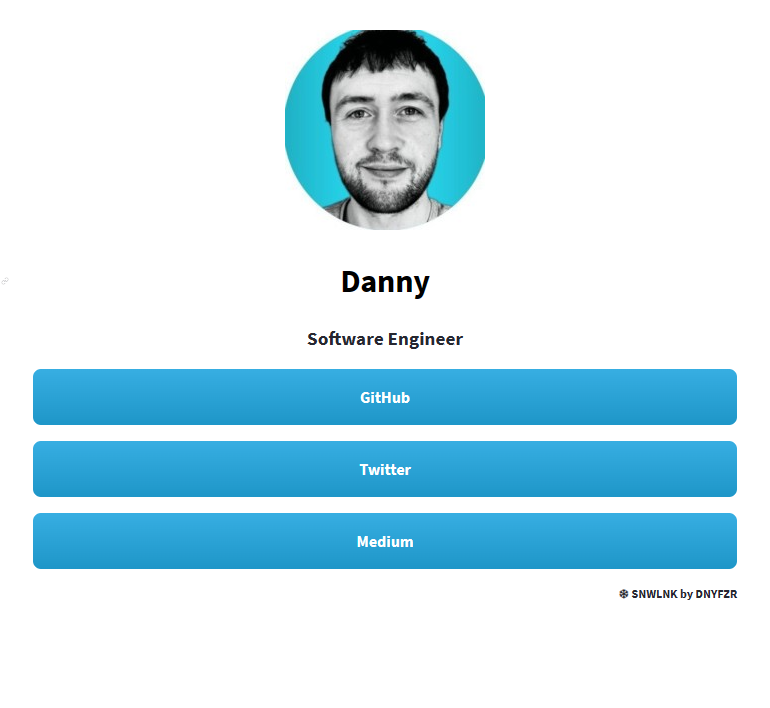

<h2 align="center"><b> ❄ SNWLNK ❄ </b></h2>

---

Just a bit of mini project fun - I've put together a link tree type app, using Python, CSS & Streamlit.

This app allows you to easily configure the displayed content by using a YAML input file for the majority of the user input.

Once configured, you will have something like this...

<p align="center"></p>

<br>

---

To configure SNWLNK, edit the files in the config directory.

The first is a YAML file which has two sections:

1. Header Info - Provide your preferred display name, and a small bio.

    ````yml
    # Header info
    name: "Danny"
    bio: "Software Developer"
    ````

2. Links - Use the desired display name for each link as the key, and the link itself as the value

    ````yml
    # Links
    GitHub: "https://github.com/DNYFZR"
    Twitter: "https://twitter.com/@DNYFZR"
    ````

The second is a picture (JPG / PNG etc) - this will be displayed at the top of your SNWLNK.

<br>

---
---
